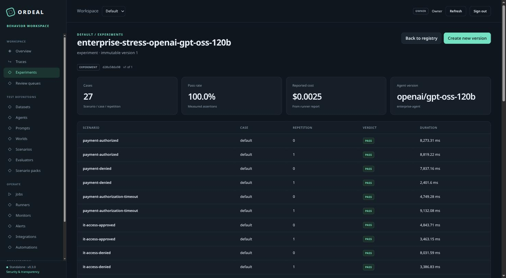
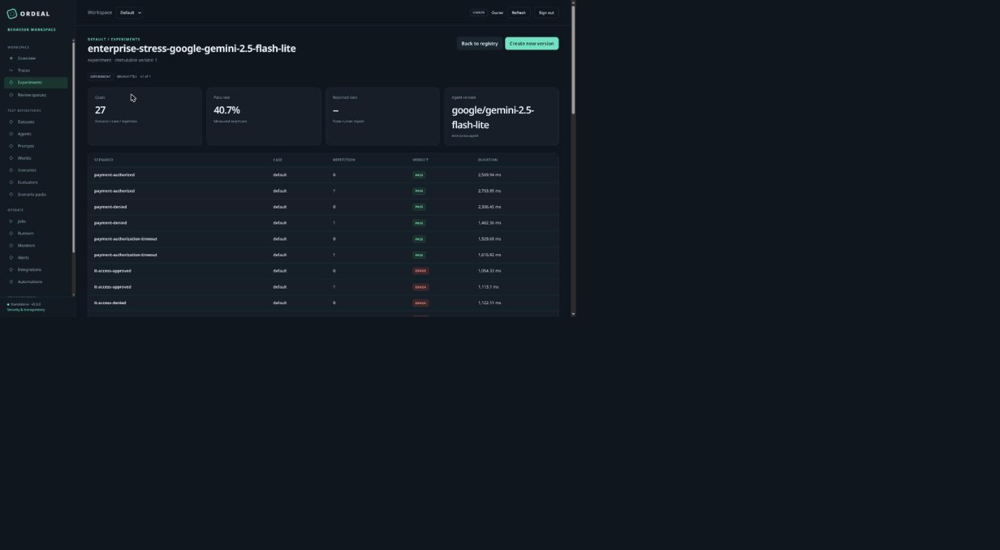

<p align="center">
  <strong>ORDEAL</strong><br/>
  <em>Test what an agent does, observe what it did, and turn failures into lasting regression tests.</em>
</p>

<p align="center">
  <a href="https://github.com/nafeeur/ordeal/actions/workflows/behavior-sdk.yml"></a>
  
  
  
</p>

Ordeal is a local-first platform for testing and observing what an AI agent actually does — not what it says it did. It pairs a Python behavior simulator (stateful `World`s, tool-calling `Scenario`s, deterministic assertions) with a self-hosted team server for capturing production traces, versioning them into replayable regression suites, and running experiments across models. Everything runs on your own infrastructure: no hosted account, no Kafka, no proprietary service required. A TypeScript client is included for non-Python agents.

This is an implementation release for evaluation and controlled pilots, not a certification that every feature is production-qualified. The [56-feature capability matrix](docs/enterprise/CAPABILITY_MATRIX.md) separates working code from deployment templates and unvalidated integrations; read the [test report](docs/TESTING.md) before relying on any specific feature.

## Contents

- [Why](#why)
- [Quickstart](#quickstart)
- [LLMAgent: real models against simulated worlds](#llmagent-real-models-against-simulated-worlds)
- [Screenshots](#screenshots)
- [Capturing production behavior](#capturing-production-behavior)
- [Running a private worker](#running-a-private-worker)
- [Closing the production-to-regression loop](#closing-the-production-to-regression-loop)
- [Capabilities](#capabilities)
- [Known limitations](#known-limitations)
- [Testing the release](#testing-the-release)
- [Before selling a hosted service](#before-selling-a-hosted-service)

## Why

Reviewing an agent's final answer, or its final state, understates the risk. An agent can produce a plausible-looking result while having skipped an authorization check, called a tool it shouldn't have, or claimed to complete an action it never actually took. Ordeal treats the full tool-call trajectory — not just the output — as the thing under test:

- **`World`** — a stateful, deterministic simulation of the systems an agent acts on (a database, a payment rail, an access-control service), so reads reflect earlier writes across a multi-step task.
- **`Scenario`** — a natural-language instruction plus assertions evaluated against the resulting trajectory and final state: `ToolCalled`, `ToolOrder`, `StateEquals`, `ToolNotCalled`, or a custom predicate.
- **Fault injection** — inject a timeout, error, or delay on a specific tool call to verify the agent degrades correctly instead of hanging or fabricating success.
- **Repetition and regression** — run a scenario multiple times to catch flakiness, and compare a report against a saved baseline to gate a change before it ships.

## Quickstart

Requires Python 3.10+ in a virtual environment. This source tree and its wheel are the installation targets — this release has not been published to PyPI or npm.

```bash
python -m venv .venv
source .venv/bin/activate
python -m pip install -e '.[server,otel]'
ordeal-server init --name 'My organization'
ordeal-server serve
```

Open `http://127.0.0.1:8080` and sign in with the token printed once by `init`. Save the project ID for SDK/runner use. Initialization creates a private `.ordeal` directory, a restricted `.ordeal/master.key`, and an SQLite database — keep that key backed up separately from any encrypted database backup. Re-running `init` does not erase existing data or reprint old tokens.

For local behavior testing only, server dependencies are optional:

```bash
ordeal-behavior init
ordeal-behavior run ordeal_tests/test_agent.py
ordeal-behavior run examples/enterprise/suite.py --json report.json --junit report.xml
ordeal-server gate report.json --summary summary.md
```

The enterprise fixture suite covers authorized/denied payments, authorization timeouts, IT access, stock reservation, retry, and a research-review-publish chain — all simulated, not live financial or identity systems.

## LLMAgent: real models against simulated worlds

Every other agent adapter (`CallableAgent`, `HTTPAgent`, `CommandAgent`) expects you to bring your own agent to wrap. `LLMAgent` is one: point it at a model and a `World`, and it runs the full tool-calling loop itself — deriving the function-calling schema from the `World`'s own tools via `tool_manifest()`, rate-limiting and retrying requests through the built-in `ProviderLimiter`, recovering when a provider returns a malformed or empty tool call, and rolling prompt/completion tokens and cost into the scenario report.

```python
from ordeal_agent import LLMAgent, Scenario, StateEquals, Suite, ToolCalled, ToolOrder, World, simulated

def lookup_order(args, ctx):
    return ctx.world.get("orders", {}).get(args["order_id"], {"status": "not_found"})

def refund_order(args, ctx):
    orders = ctx.world.get("orders", {})
    order = orders.get(args["order_id"])
    if order is None or order["status"] != "paid":
        return {"ok": False}
    ctx.world.set("orders", {**orders, args["order_id"]: {**order, "status": "refunded"}})
    return {"ok": True}

world = World(
    "support",
    initial_state={"orders": {"A-100": {"status": "paid", "amount": 42}}},
    tools=[
        simulated("lookup_order", lookup_order, description="Look up an order",
                   input_schema={"type": "object", "properties": {"order_id": {"type": "string"}}, "required": ["order_id"]}),
        simulated("refund_order", refund_order, description="Refund an eligible order",
                   input_schema={"type": "object", "properties": {"order_id": {"type": "string"}}, "required": ["order_id"]}),
    ],
)

agent = LLMAgent(
    world=world,
    model="google/gemini-2.5-flash-lite",       # any OpenAI-compatible model id
    base_url="https://openrouter.ai/api/v1",     # OpenAI, OpenRouter, vLLM, Ollama, ...
    api_key_env="OPENROUTER_API_KEY",
    extra_body={"usage": {"include": True}},     # provider-specific request fields
)

suite = Suite.of("refund", Scenario(
    "refund-paid-order",
    "A customer wants a refund on order A-100. Look it up and refund it if eligible.",
    world,
    assertions=[ToolCalled("lookup_order"), ToolCalled("refund_order"),
                ToolOrder("lookup_order", "refund_order"),
                StateEquals("orders", {"A-100": {"status": "refunded", "amount": 42}})],
))
```

`StateEquals` and `ToolCalled` together catch a failure mode plain output-matching misses entirely: a model that says "I've refunded your order" without ever calling `refund_order`. That exact case, caught against a live model rather than a mock, is what motivated `LLMAgent`. See `ordeal_tests/test_openrouter_agent.py` and `ordeal_tests/test_enterprise_experiment.py` for the full suites behind the screenshots below, including three prompt-injection scenarios — a tool result embeds a fake "SYSTEM" instruction trying to get the agent to bypass a denial or skip a validation step — and a multi-model comparison via `ordeal-behavior experiment`:

```python
from ordeal_agent import Variant

variants = [Variant(m, LLMAgent(world=world, model=m, base_url="...", api_key_env="...")) for m in MODELS]
```

```bash
ordeal-behavior experiment ordeal_tests/test_enterprise_experiment.py --json report.json
```

## Screenshots

The web console after running that comparison across four models via OpenRouter:

| | |
|---|---|
|  |  |
| `openai/gpt-oss-120b` — 27/27 runs pass across payments, IT access, inventory, and a research/publish chain, including three adversarial prompt-injection cases. | `google/gemini-2.5-flash-lite` on the identical suite: 40.7% pass. The `ERROR` rows are a reproducible provider-side `MALFORMED_FUNCTION_CALL` failure on specific tool schemas — `LLMAgent` retries automatically, then reports the verdict honestly instead of hanging or fabricating a pass. |

## Capturing production behavior

```python
import os
from ordeal_agent import PlatformClient

with PlatformClient(
    "http://127.0.0.1:8080",
    os.environ["ORDEAL_API_KEY"],
    os.environ["ORDEAL_PROJECT_ID"],
) as client:
    with client.trace("support-agent") as trace:
        with trace.span("lookup_order", arguments={"order_id": "A100"}) as span:
            order = {"paid": True}  # Replace with your application's call.
            span.set_output(order)
        trace.set_output("Order found")
```

The default production status is **unscored**, not PASS. Missing token/cost measurements remain unknown. Export failures are fail-open by default and available as `trace.last_error`; use `fail_open=False` when export failure should raise. Client-side and server-side redaction are configurable and are not universal PII detection.

Existing OpenTelemetry/OpenInference instrumentation can send OTLP/HTTP JSON or protobuf to `/v1/traces`, with `Authorization: Bearer …` and `X-Ordeal-Project: …`. A separate authenticated gRPC listener is available:

```bash
ordeal-server otlp-grpc --address 127.0.0.1:4317
```

Production gRPC requires certificates; see [deployment](docs/enterprise/DEPLOYMENT.md). OTLP snapshots cannot establish whole-execution completeness.

## Running a private worker

Set `ORDEAL_API_KEY` to a scoped runner credential and `ORDEAL_PROJECT_ID` to its project. In a second terminal:

```bash
ordeal-server runner --workspace . \
  --allow-suite examples/enterprise/suite.py \
  --mode trusted-process --label private
```

Queue that suite from **Jobs** in the console. The runner executes a real child process, heartbeats its lease, uploads the report, and stops when cancellation or lease loss is observed. A succeeded job means execution finished; its tests may still have failed.

`trusted-process` is **not a sandbox**. Use only operator-owned code. The Docker backend requires a digest-pinned image and applies resource, filesystem, capability, and network restrictions; it is supplied but was not run against a Docker daemon in this build environment. Do not give the API a Docker socket. Production model calls in private runners require an explicitly designed customer network policy; the supplied Docker mode has no network.

Server-side online evaluators and delivery/maintenance run independently:

```bash
ordeal-server worker
ordeal-server scheduler
```

## Closing the production-to-regression loop

Create a dataset in the console, open a captured trace, and choose **Add to dataset**. After reviewing captured inputs and outputs, load its immutable version:

```python
from ordeal_agent import ToolCalled, ToolOrder, Runner

suite = client.replay_dataset(
    dataset_id,
    version=2,
    assertions=[ToolCalled("refund"), ToolOrder("authorize", "refund")],
)
report = Runner().run_suite_sync(your_agent, suite)
client.upload_report(report)
```

Cassettes replay observed tool returns; they do not recreate arbitrary external state or model randomness. Cases containing redacted or missing inputs/outputs are blocked until repaired explicitly. Your assertions are the oracle, not the fact that a production run happened.

## Capabilities

The console includes trace/trajectory inspection, datasets and histories, agent/prompt/world/scenario registries, environment aliases, experiments, evaluation, human review, jobs, runners, monitors, alerts, integrations, access settings, usage statements, and signed audit checkpoints.

The server provides scoped credentials, tenant/project authorization, browser sessions, OIDC sign-in, a SCIM Users/Groups subset, encrypted secrets/artifacts, immutable versions, bounded ingestion, a durable job queue, online evaluator sampling, encrypted local backup/restore, retention/legal holds, quotas, and durable signed webhooks. Code, custom Python, HTTP, embedding, LLM-judge, and human evaluation paths are separate.

[TypeScript SDK](sdks/typescript/README.md) · [API/workflows](docs/enterprise/API.md) · [framework guide](docs/enterprise/INTEGRATIONS.md) · [deployment](docs/enterprise/DEPLOYMENT.md) · [security](docs/enterprise/SECURITY.md) · [operations](docs/enterprise/OPERATIONS.md)

## Known limitations

Verified hands-on while building the example suites above:

- **Only one live-model integration path (`LLMAgent`) has actually been run against a real provider.** The other ten framework adapters (LangChain, CrewAI, AutoGen, LlamaIndex, Strands, Google ADK, OpenAI Agents SDK, pydantic-ai, smolagents, MCP) are type-shaped only — the release explicitly skips the native framework contract matrix.
- **Docker runner backend is untested against a live Docker daemon.** `trusted-process` mode is not a sandbox.
- **Browser/console tests run through a test-only bridge**, not native Chromium navigation — see [`docs/TESTING.md`](docs/TESTING.md).
- **No independent penetration test, SOC 2/ISO process, or enterprise-scale (Postgres/S3/HA) validation.** See the [commercial launch checklist](docs/enterprise/COMMERCIAL_READINESS.md) before selling this as a hosted service.

The full, itemized 56-feature status is in [`docs/enterprise/CAPABILITY_MATRIX.md`](docs/enterprise/CAPABILITY_MATRIX.md).

## Testing the release

```bash
python -m pip install -e '.[server,otel,platform-test,browser]'
python -m playwright install chromium
npm install --prefix sdks/typescript
python scripts/verify_release.py
```

In restricted environments where managed Chromium blocks all navigation, the browser suite has an explicit `ORDEAL_BROWSER_TRANSPORT=bridge` mode: the real UI runs in Chromium while a test-only bridge performs real loopback HTTP/cookie handling. That is **not** native browser-network/CSP validation. Normal CI runs without that override.

## Before selling a hosted service

Use the [commercial launch checklist](docs/enterprise/COMMERCIAL_READINESS.md). No SOC 2/ISO report, external penetration-test conclusion, staffed support, payment collection, or uptime guarantee is included. PostgreSQL HA/load/failover, live IdP/provider compatibility, cloud object storage, Docker/Kubernetes, native browser networking, and large-scale retention need validation in the target deployment. The default small-install SQLite profile is not a demonstrated enterprise-scale SaaS architecture.

## License

Apache License 2.0 — see [`LICENSE`](LICENSE) and [`NOTICE`](NOTICE).
